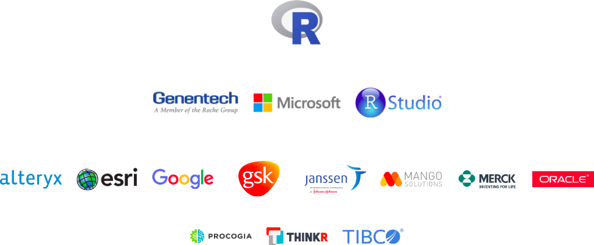
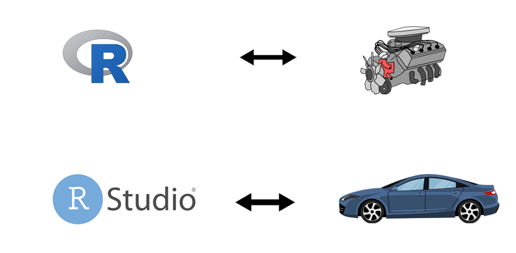

```{r setup, include=FALSE}
knitr::opts_chunk$set(
  fig.height = 5,
  fig.show = "hide",
  fig.path = "figures/",
  fig.retine = 5,
  message = FALSE,
  warning = FALSE,
  cache = T,
  cache.path = "cache/"
)
options(htmltools.dir.version = FALSE, servr.daemon = TRUE, 
        htmltools.preserve.raw = FALSE)
library(countdown)
library(xaringanExtra)
library(fontawesome)
xaringanExtra::use_panelset()
xaringanExtra::html_dependency_webcam()
# These are the defaults
xaringanExtra::use_extra_styles(
  hover_code_line = TRUE,         #<<
  mute_unhighlighted_code = TRUE  #<<
)
# xaringan::summon_remark()
```

layout: true
<div class="my-header"></div>
<div class="my-footer"></div>
---
class: middle, center

# Getting Started with


---
class: left, top

## About Company (https://numericmind.com)


---
class: center, top

# Know Your Instructor

<br>

.pull-left[

<div class="card">
  
  <h3>Binod Jung Bogati</h3>
  <p class="title">Data Scientist, Numeric Mind</p>
  <p>binod.bogati@numericmind.com</p>
  <a href="#" style="font-size: 30px;padding:0 10px;">`r fa("twitter", fill = "black")`</a>
  <a href="#" style="font-size: 30px;padding:0 10px;">`r fa("linkedin", fill = "black")`</a>
  <a href="#" style="font-size: 30px;padding:0 10px;">`r fa("facebook", fill = "black")`</a>
</div>

]

.pull-right[


<div class="card">
  
  <h3>Sanjay Hamal</h3>
  <p class="title">Data Analyst, Numeric Mind</p>
  <p>sanjay.hamal@numericmind.com</p>
 <a href="#" style="font-size: 30px; padding:0 10px;">`r fa("twitter", fill = "black")`</a>
  <a href="#" style="font-size: 30px;padding:0 10px;">`r fa("linkedin", fill = "black")`</a>
  <a href="#" style="font-size: 30px;padding:0 10px;">`r fa("facebook", fill = "black")`</a>
</div>

]


---
class: top, center

## Top Companies Supporting 



---
class: top, left

## R and RStudio



---
class: middle, center

# Setup R + RStudio

---
class: top, left

## Download / Install (learnr.numericmind.com/setupr)

<iframe src="https://learnr.numericmind.com/setupr/" width="100%" height="500px">


---
class: top, left

# Setup R Packages

.panelset[
.panel[.panel-name[Eco-system]

]
.panel[.panel-name[Load]
.pull-left[

```{r first_ggplot2, echo=T, include=T}
library(ggplot2)
ggplot(cars, aes(x = speed, y = dist)) +
  geom_point()
```

Here, 

- speed - miles per hour
- dist - stopping distance (ft)

]


.pull-right[

<!-- `) -->

```{r echo=FALSE}
library(ggplot2)
ggplot(cars, aes(x = speed, y = dist)) +
  geom_point()
```


]
]
.panel[.panel-name[About]
- R packages are a collection of functions, complied code & sample data
- Comprehensive R Archive Network (CRAN) has now **17513** packages 

]
.panel[.panel-name[Install]

To install and load package we use following:

```{r eval = F}
# install.packages("devtools") #install
# library(devtools) #load
# devtools::install_github("nm-training/rsetup")
```

]

.panel[.panel-name[Ask]


- ask about the mean() function

```{r eval=F}
?mean
```

- ask about the mtcars data sets

```{r eval=F}
?cars
```


- ask about the dplyr package

```{r eval=F}
?devtools
```

]

]