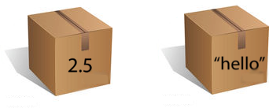
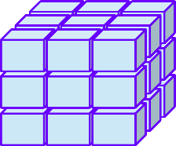
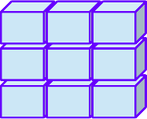
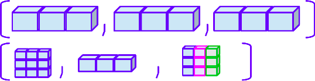
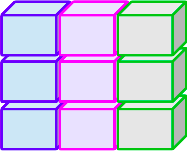

```{r setup, include=FALSE}
knitr::opts_chunk$set(warning = FALSE, message = FALSE)
options(htmltools.dir.version = FALSE, servr.daemon = TRUE, 
        htmltools.preserve.raw = FALSE)
library(countdown)
library(xaringanExtra)
xaringanExtra::use_panelset()
xaringanExtra::html_dependency_webcam()

# These are the defaults
xaringanExtra::use_extra_styles(
  hover_code_line = TRUE,         #<<
  mute_unhighlighted_code = TRUE  #<<
)

#xaringan::summon_remark()
```

layout: true
<div class="my-header"></div>
<div class="my-footer"></div>
---

class: middle, center

# Intro to R Programming

---
class: top, left,  highlight-last-item

## Things to do

- Install **R, RStudio** (& **RTools4** for Windows users) 

--

- Install **library(rsetup)** Package

---
layout: false

background-image: url("image/00_IDE-RStudio.png")
background-size: contain

---
background-image: url("image/01_editor-rstudio.png")
background-size: contain

---
background-image: url("image/02_rconsole-rstudio.png")
background-size: contain

---
background-image: url("image/03_environment-rstudio.png")
background-size: contain

---
background-image: url("image/04_filesoutput-rstudio.png")
background-size: contain

---
background-image: url("image/05_working_time.png")
background-size: contain

---
layout: true
<div class="my-header"></div>
<div class="my-footer"></div>

---
class: top, left

## Your Turn

`r countdown(minutes = 0, warn_when = 10, seconds = 120,  top = 0)`

- Copy the File from GitHub

- Open 01_basic_R.Rmd and look around

---
class: top, left, highlight-last-item

## Reserved words in R

--

Reserved words (or keywords) are a set of words that have special meaning.

--

.panelset[
.panel[.panel-name[About]

- It cannot be used as an identifier (variable name, function name etc.).

- You can type `?reserved` in R console to see list of reserved words in R.

```{r eval = F}
?reserved #<<
```

]


.panel[.panel-name[Examples]


| Reserved words |
| --- |
| if   else  repeat  |
| while function for in next break |
| TRUE  FALSE |
| NULL Inf NaN |
| NA NA_integer_ |
| NA_real_ NA_complex_ NA_character_ |

]

]

---
class: top, left, highlight-last-item

## Variables & Constants

--

.panelset[
.panel[.panel-name[Variable]

.pull-left[
- Variables are used to store data in R. 
- In variable, we can change data as per our need. 

- Example: 

```{r}
a <- 4 #<<
```
]

.pull-right[

.center[

]

]

]

.panel[.panel-name[Constant]

.pull-left[

- Constants are those whose value cannot be changed. 

- Example: 


```{r}
2.5 #<<
"hello" #<<
```

]

.pull-right[

<br><br><br><br>

.center[

]

]

]


.panel[.panel-name[Assignment]

.pull-left60[

- We use "<-" (arrow) operator to assign a value 

- A variable can hold different data types.


```{r}
num <- 123 #<<
alp <- "abc" #<<

print(num)
print(alp)
```
]

.pull-right40[

<br><br><br><br><br>

.center[

]

]

]

.panel[.panel-name[Comments]

.pull-left60[

- Comments are helper text in R program

- Written using **#** in the statement.

- Makes our code understandable.


```{r}
# assign value 1 to a #<<
a <- 1

# print variable a #<<
print(a)
```

]

.pull-right40[

<br><br><br><br>

.center[

]

]


]

]


---
class: top, left

## Your Turn 01


`r countdown(minutes = 0, warn_when = 10, seconds = 60,  top = 0)`

.panelset[
.panel[.panel-name[Question]


- Assign some number to **num1** variable and print out.

- Assign alphabet to **alpha1** variable and print out.

- Don't forget to write some comments.

]

.panel[.panel-name[Answer]

Assign some number to **num1** variable and print out

```{r}
# assiging 123 to num1
num1 <- 123
print(num1)
```

Assign alphabet to **alpha1** variable and print out

```{r}
#assigning apple to alpha1
alpha1 <- "apple"
print(alpha1)
```


]

]


---
class: top, left, highlight-last-item

## Naming Convention

.panelset[
.panel[.panel-name[Rules]

- Variable name must start with a letter (A-Z, a-z)

- Only accepts letters, numbers, dot and underscore

- Case is sensitive (A vs a)

]

.panel[.panel-name[Example 1]


- Incorrect

```{r eval=FALSE}
.my_data <- 500 #<< 
1_my_data <- 345 #<< 
```

- Correct

```{r}
my_data <- 200
my_1data <- 400
```


]

.panel[.panel-name[Example 2]

Here, mydata and MyData are different

```{r}
mydata <- 234
MyData <- 567
```

```{r}
print(mydata)
print(MyData)
```
]

]


---
class: top, left, highlight-last-item

## Data Types

.panelset[
.panel[.panel-name[About]

- Help us know what type of data a variable is holding.

- We can use **class()** function to determine data type of variable

]

.panel[.panel-name[Types]

Data Types | Values
--- | ---
Logical | TRUE / FALSE
Numeric | 123 (Integer) , 2.55 (Double)
Character | "a" , "abc"
Date | "2021-02-20"
Factor | "Male" "Female"

]


.panel[.panel-name[Examples]


```{r}
class(mydata)
```

]
]

---
class: top, left

## Your Turn 2


- Find the class of the variable you defined in **Your Turn 1** i.e num1 and num2

`r countdown(minutes = 0, warn_when = 10, seconds = 60,  top = 0)`

--

.panelset[
.panel[.panel-name[Answer]

```{r}
# datatype in num1 and alpha1
class(num1)

class(alpha1)
```

]
]


---
class: top, left, tabbg

## Data Structures

--

Data Structure are the R Objects that is used to store some kind of data.

--

.panelset[
.panel[.panel-name[About]

Type | Description
--- | ---
Homogeneous | Store a single data type
Heterogeneous | Store more than one data type 

]

.panel[.panel-name[Homogeneous]

Type | Visual | Description
--- | --- | ---
Vector |  | A one-dimensional structure having same data type
Array |  | An n-dimensional structure that expands on a vector.
Matrix |  | A two-dimensional array.

]

.panel[.panel-name[Heterogeneous]

Type | Visual | Description
--- | --- | ---
List |  | Similar to vector but can contain items of different types
Data frame |  | Similar to matrix (2D), but each columns can have different data types.

]

]

---
class: top, left

## Vector

--

.panelset[
.panel[.panel-name[About]

.pull-left60[

- A one-directional structure having same data type.

- It is created using **c()** function. 

- Comma (,) is used to separate vector elements

]

.pull-right40[

.center[

]
]
]

.panel[.panel-name[Example]

.pull-left[

```{r}
# create new vector
vec1 <- c(1,2,3) #<<
vec2 <- c("ram","shyam",1) #<<

print(vec1)
print(vec2)
```

]

.pull-right[

```{r}
# find data types of vector

class(vec1) #<<
class(vec2) #<<
```

]
]

]

---
class: top, left

## Your Turn 3

`r countdown(minutes = 0, warn_when = 10, seconds = 60,  top = 0)`

.panelset[
.panel[.panel-name[Question]

- Create a new vector called **vec3**

- Find the data type of **vec3**

]

.panel[.panel-name[Answer]

```{r}
vec3 <- c("a", 1, "b", 2) #<<

vec3

class(vec3) #<<
```

]
]

---
class: top, left, tabbg

## Operators

We have 3 basic operators in R.

--

<br>

| Operators |
| --- |
| Arithmetic Operators |
| Relational Operators |
| Logical Operators    |

---
class: top, left

## Arithmetic Operators

Operators that performs arithmetic operations between two elements.

--

.panelset[
.panel[.panel-name[Operator]

Operator | Meaning
--- | ---
+ | Add
- | Subtract
* | Multiplication
/ | Division
^ | Exponent
%% | Modulus

]

.panel[.panel-name[Addition]

```{r}
a <- c(5,6,7)
b <- c(2,1,3)

print(a + b) #<<
```

]

.panel[.panel-name[Multiply]

```{r}
a <- c(1,2,3)
b <- c(2,3,4)

print(a * b) #<<
```

]

.panel[.panel-name[Subtraction]

```{r}
a <- c(9,8,7)
b <- c(2,4,9)

print(a - b) #<<
```

]

.panel[.panel-name[Division]

```{r}
a <- c(22,13,24)
b <- c(2,3,4)

print(a / b) #<<
```

]

.panel[.panel-name[Exponent]

```{r}
4 ^ 2 #<<
99 ^ 3 #<<
```

]

.panel[.panel-name[Modulus]

```{r}
7 %% 2 #<<
99 %% 8 #<<
```

]
]

---
class: top, left

## Relational Operators

Operators that compare two elements or vectors.

--

.panelset[
.panel[.panel-name[Operator]

Operator | Definition
--- | ---
> | Greater than
< | Less than
== | Equals to
!= | Not Equals to
>= | Greater than or equal to
<= | Lesser than or equal to

]

.panel[.panel-name[">"]

- Greater than ( > )

```{r}
a <- c(5,2,3,4)
b <- c(10,1,2,9)

print(a > b) #<<
```

]

.panel[.panel-name["<"]

- Less Than ( < )

```{r}
a <- c(9,10,11,21)
b <- c(11,2,3,55)

print(a < b) #<<
```

]

.panel[.panel-name["=="]

- Equals to ( == )

```{r}
a <- c(1, 2, 3)
b <- c(2,3,5)

print(a == b) #<<
```

]

.panel[.panel-name["!="]

- Not Equal to (!=)

```{r}
a <- c(2,3,4,10)
b <- c(1,3,4,9)

print(a != b) #<<
```

]

.panel[.panel-name[">="]

- Greater than equal to (>=)

```{r}
a <- c(2,3,4,10)
b <- c(5,7,4,9)

print(a>=b) #<<
```

]

.panel[.panel-name["<="]

- Less than equal to (<=)

```{r}
a <- c(2,3,4,9)
b <- c(2,5,7,8)

print(a <= b) #<<
```

]

]

---
class: top, left

## Logical Operators

Operator which gives boolean values (TRUE or FALSE) when compared.

--

.panelset[
.panel[.panel-name[AND (&)]

It gives .green[TRUE] value only when both condition result are .green[TRUE].

```{r}
a <- c(3,9,5)
b <- c(5,6,7)

print(a>5 & b>5) #<<
```

]

.panel[.panel-name[OR (|)]

It gives .green[TRUE] value when one of the condition result is .green[TRUE].

```{r}
a <- c(1,5,3)
b <- c(4,5,6)

print(a<5 | b>5) #<<
```

]


.panel[.panel-name[NOT (!)]

It makes the .green[TRUE] to .red[FALSE] and Vice-versa.

```{r}
a <- c(3,4,5)

print(!(a>3)) #<<
```

]
]


---
class: top, left

## Function

.panelset[
.panel[.panel-name[About]

.pull-left60[
- A set of statements which perform a specific task 

- R has a large number of in-built functions
]

.pull-right40[


]


]

.panel[.panel-name[Syntax]

```{r eval=F}
function_name <- function(arg_1, arg_2)
{
 function_body
  
 return_value
}
```

Here, 

- **function_name**: Name of the Function, stored in R environment as an object
- **arg_x**: Argument as the inputs
- **function_body**: Operations performed based the input
- **return_value**: Final output of the function

]

.panel[.panel-name[Types]

Types | Description
---|---
Built-in | Pre-defined function 
User-defined | Defined by user using R program

]


.panel[.panel-name[Built-in]

Function | Descriptions
---|---
print() | Displays an output
sum() | Sum value
seq() | Generates a sequence
mean() | Mean value
median() | Median value
min() | Minimum value
max() | Maximum value


]

.panel[.panel-name[Examples]

- Create a sequence of numbers from 5 to 10.
- Find mean of numbers from 5 to 10.
- Find sum of numbers from 10 to 20.

```{r}
print(seq(5, 10))
```

```{r}
print(mean(5:10))
```

```{r}
print(sum(10:20))
```


]

.panel[.panel-name[User-Defined]

- Function for adding number

```{r}
add_me <- function(num1, num2){
  sum <- num1 + num2
  return(sum)
}

add_me(99, 123)
```
]
]

---
class: top, left, tabbg

## Data frame


.panelset[
.panel[.panel-name[About]

.pull-left[

- a table with rows and columns.

- each column contain values of a respective variable.

- each row contain values of different variable.
]

.pull-right[

.center[

]

]

]

.panel[.panel-name[Helper]

Function | Description
--- | ---
data.frame() | create a data frame
head() |  first 6 rows of data
tail() |  last 6 rows of data
nrows() |  number of rows
ncols() |  number of cols
dim() |  dimension / shape of data
str() |  structure of data
names() |  column names

]

.panel[.panel-name[Head/Tail]

.pull-left[
```{r}
head(cars) 
```
]

.pull-right[

```{r}
tail(cars)
```
]
]

.panel[.panel-name[Create]

- Here, we pass values in each column using vector.

```{r}
data <- data.frame(
  id = 1:6,
  name = c("Rohan", "Illesh", "Roshmi", "Ram", "Sunita", "Sriyam"),
  state = c("California", "Pennsylvania", "California", "Florida", "New Jersey", "New Hampshire"),
  tools_used = c("Excel", "Excel", "Excel", "Google Sheets", "Google Sheets", "Google Sheets"),
  gender = c("Male", "Male", "Female", "Male", "Female", "Male")
)

```

]

.panel[.panel-name[Shape]

```{r}
nrow(data) #<<

ncol(data) #<<

dim(data) #<<
```

]

.panel[.panel-name[Names]

```{r}
names(data)
```

]

.panel[.panel-name[Structure]

- We use **str()** to get structure of data.

```{r}
str(data)
```

]

.panel[.panel-name[Summary]

- We use summary() to get summary statistics of data.

```{r}
summary(data)
```

]

]
